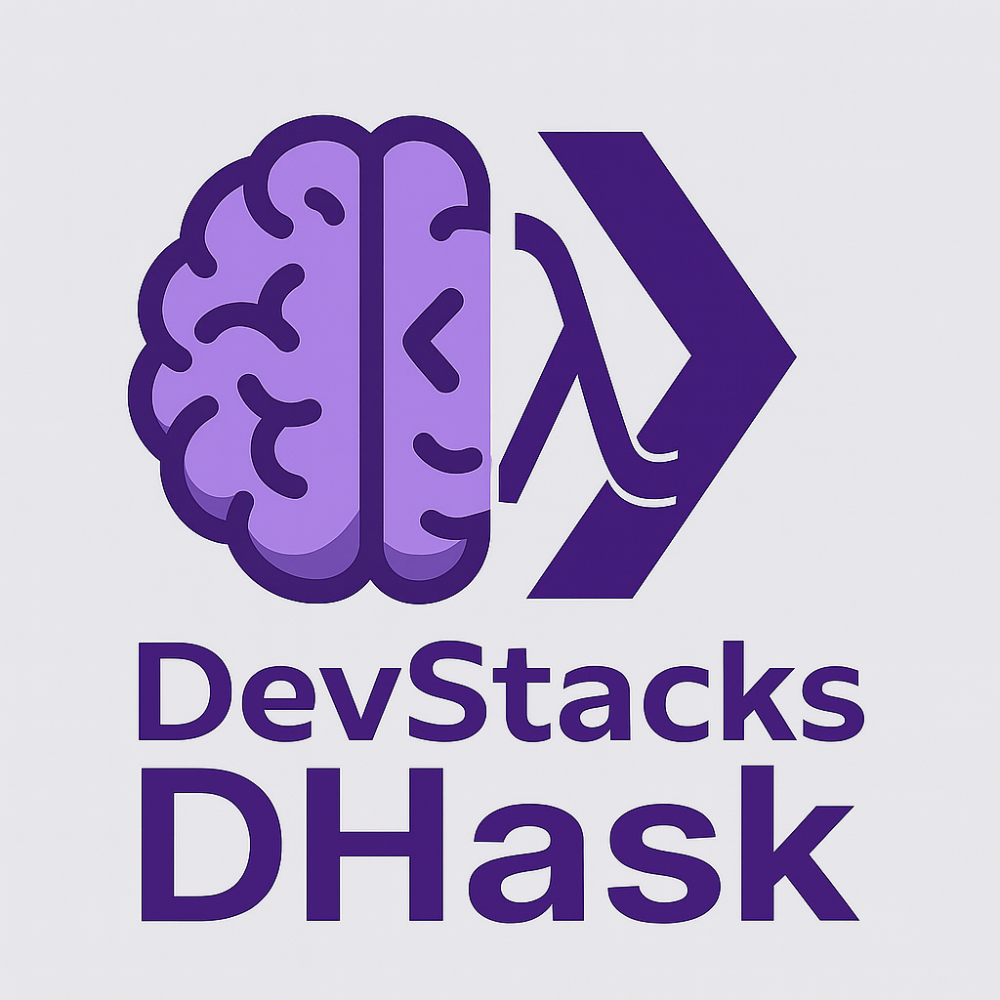

  

<h1 align="center">DevStacks DHask</h1>

# DHask 🧠

**DHask** is DevStacks’ rebranded fork of [GHC (Glasgow Haskell Compiler)](https://github.com/ghc/ghc), designed to fit into the DevStacks developer ecosystem via [DLangSDK](https://github.com/DevStacks-io/DLangSDK).

---

## 🎯 What is DHask?

DHask brings all the power of Haskell’s advanced type system, functional purity, and laziness into the DevStacks Universe. It is fully aligned with our mission to give developers lightweight, language-diverse tools without vendor lock-in.

---

## 🔧 Features (inherited from GHC)

- Static, strong, and expressive type system
- Laziness by default
- Type inference and pattern matching
- Concurrency and STM

---

## 🧱 Integration

Use [DLangSDK](https://github.com/DevStacks-io/DLangSDK) to launch `dhask` from a unified cross-platform compiler interface.

DHask is part of the [HobbyStack](https://github.com/DevStacks-io/HobbyStack), which includes functional and experimental languages supported by DevStacks.

---

## 📜 License & Attribution

This project is licensed under the **BSD 3-Clause License** (original license from GHC).

> Originally forked from: [https://github.com/ghc/ghc](https://github.com/ghc/ghc)  
> All core contributions and credits go to the GHC maintainers and community.  
> Modified and distributed by [DevStacks.io](https://github.com/DevStacks-io)
